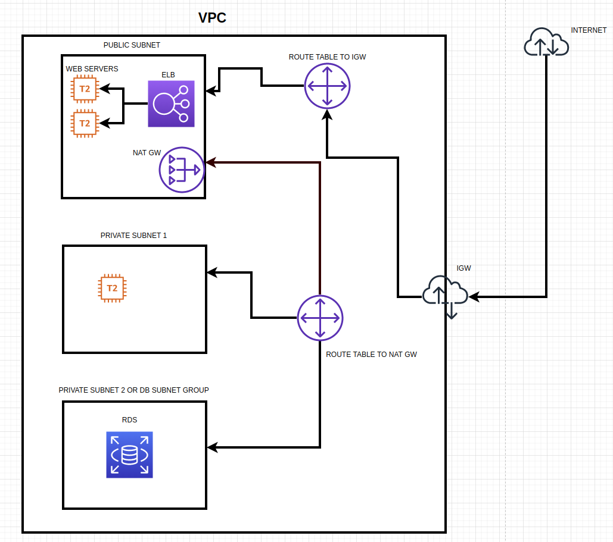

# Terraform Lab 1

Still working on these 2 items but the terraform file main.tf builds the infrastructure below   
1. Modularize the root module   
2. Fix AZ error when creating the RDS DB instance : DBSubnetGroupDoesNotCoverEnoughAZs   

